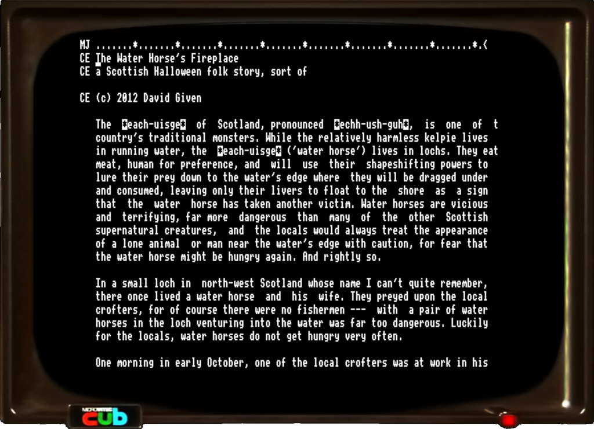
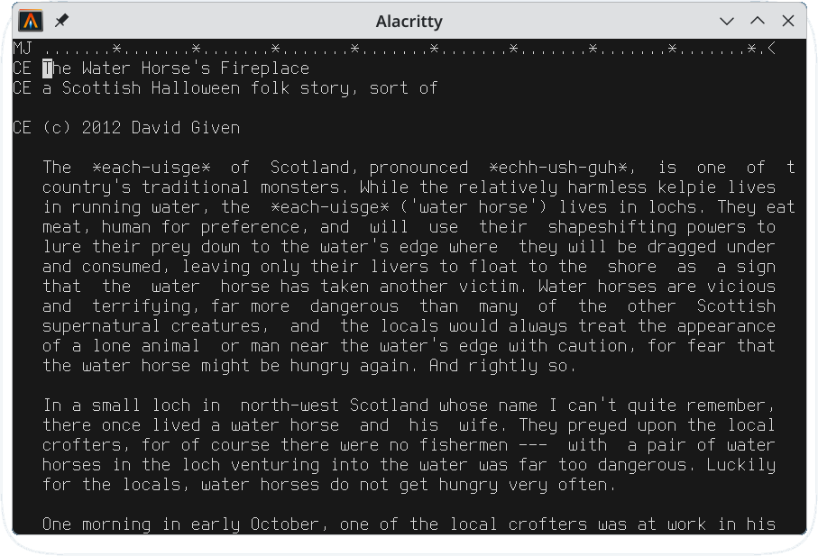

Acornsoft VIEW
==============

# What?

VIEW is a word processor developed by Acorn for their BBC Micro series of
6502-based computers. It was most commonly found on the BBC Master, where it was
bundled on ROM alongside its companion spreadsheet, ViewSheet.

It's a basic but functional semi-WYSIWYG word processor supporting
justification, tabination, page formatting with headers and footers, multiple
rulers, editing of files bigger than will fit in memory (crudely),
search-and-replace, word count, text styles, and so on. It also features
loadable printer drivers so that it will work with a variety of printers.

This project contains two things:

- a copy of the original ROM for version B3.0, a mostly-symbolified disassembly
of it using ZornsLemma's [py8dis](https://github.com/ZornsLemma/py8dis]), plus a
port of it to my own [CP/M-65](https://github.com/davidgiven/cpm65) operating
system (which does also run on the BBC Micro, for maximum recursion).

- a decompiled and reverse engineered port of it into portable C, which will run
on most systems with stdio and some means of doing direct screen access (by
default it uses ncurses).

You might want to [read the manual](ViewGuide.pdf). You're unlikely to get
anywhere without it.

# How?

## The disassembly

The disassembly is controlled by the `view.py` Python script, which contains
information about what symbols are defined where. (These names were made up
based on analysis of the code.) py8dis then uses this, plus the original ROM, to
emit an assembler file, `view-b3.0.asm`. This is then reassembled with
[beebasm](https://github.com/stardot/beebasm) to produce a bit-for-bit identical
ROM image. No attempt has been made to fix the bugs.

The same process was done to produce the CP/M-65 version, using
[llvm-mos](https://llvm-mos.org/wiki/Welcome) syntax, which was then heavily
hand-edited to change the OS interface layer to work with CP/M. This is possible
because VIEW was written to only use Acorn's MOS system interface, which is
highly abstract and hardware-independent.

See [README-CPM.md](README-CPM.md) for more information on the CP/M-65 version.

## The C port

This lives in the `src` directory, and when you run the makefile you'll get a
binary in `bin/view`. I've taken the liberty of changing the startup banner to
display it as `C-VIEW B4.0` to distinguish it from the OG View. You can build it
on its own with `make bin/view`, or run the tests with `make tests`.

By default it uses readline for the command prompt and ncurses for the editor.
You can easily swap these out for other libraries --- see the contents of
`src/io`. There's a comprehensive test suite in `tests`.

The `scripts` directory contains a number of helper scripts which were used
during the decompilation process. Don't trust these to work, or indeed do
anything useful; they're only there for my reference.

The BBC Micro has ten function keys numbered from 0, and the original version of
VIEW is controlled almost exclusively by these. These aren't available on
other systems, so I've reworked it to use semi-WordStar controls.

<dl>
    <dt>^E, ^S, ^D, ^X</dt>
    <dd>Cursor movement. (You can also use the cursor keys, if your computer has them.)</dd>
    <dt>^Q^S, ^Q^D</dt>
    <dd>Begining of line, end of line. </dd>
    <dt>^A, ^F</dt>
    <dd>Word left, word right.</dd>
    <dt>^R, ^C</dt>
    <dd>Page up, page down.</dd>
    <dt>^Q^R, ^Q^C</dt>
    <dd>Top of file, bottom of file.</dd>
    <dt>^G, ^H</dt>
    <dd>Delete one character, insert one character.</dd>
    <dt>^P</dt>
    <dd>Swap case.</dd>
    <dt>^Y, ^N</dt>
    <dd>Delete, insert one line.</dd>
    <dt>^Q^Y</dt>
    <dd>Delete to end of line.</dD>
    <dt>^V</dt>
    <dd>Toggle insert mode.</dd>
    <dt>^B</dt>
    <dd>Reformat current paragraph.</dd>
    <dt>^T</dt>
    <dd>Delete to character.</dd>
    <dt>^L</dt>
    <dd>Next search match (when searching).</dd>
    <dt>^J, ^Q^J</dt>
    <dd>Join lines, split lines.</dd>
    <dt>^K^M, ^K1, ^K2, ^K3, ^K4, ^K5, ^K6</dt>
    <dd>Set marker.</dd>
    <dt>^Q^M, ^Q1, ^Q2, ^Q3, ^Q4, ^Q5, ^Q6</dt>
    <dd>Go to marker.</dd>
    <dt>^O^J</dt>
    <dd>Toggle justification.</dd>
    <dt>^O^F</dt>
    <dd>Toggle format mode.</dd>
    <dt>^O^X</dt>
    <dd>Margin release</dd>
    <dt>^O^C, ^O^D</dt>
    <dd>Edit command, delete command.</dd>
    <dt>^O^M, ^O^R, ^O^S</dt>
    <dd>Mark current line as ruler, copy current ruler, copy standard ruler.</dd>
    <dt>^O^U, ^O^B</dt>
    <dd>Toggle highlight 1, toggle hightlight 2.</dd>
    <dt>^K^C, ^K^V, ^K^Y</dt>
    <dd>Copy block, move block, delete block.</dd>
</dl>

The following features aren't supported:

- changing screen mode
- printing
- star commands (yes, this means you can't get a directory listing from inside
    VIEW --- sorry)

But everything else should work!

There is one extra CLI-mode command:

- `BYE` --- exits back to the shell.

## AI disclosure

Machine assistance was used extensively for the decompilation and translation to
C, as well as determining what all the various functions do. (Anyone who thinks
this made it easy is welcome to examine the commit history and see just how long
it took.) All the files in `scripts` were vibe coded, crudely.

# Who?

VIEW was written by Mark Colton, a British software developer and racing driver,
who was responsible for the development of the entire VIEW family, which was
later developed into View Professional on the BBC Micro which in turn became, on
the Acorn Archimedes family of computers, the Pipedream and Fireworkz combined
word processor/spreadsheets. (All now [open source on
Github](https://github.com/skswales)).

He was killed in a racing accident in 1995.

The additional decompilation work is owned by me, David Given, and I hereby
declare that all my work is CC0 licensed. You may contact me at <dg@cowlark.com>,
or visit my website at <http://www.cowlark.com>.  There may or may not be anything
interesting there.

# License

The copyright holder for VIEW is lost to time. Acornsoft was folded into Acorn
Computers, whose assets were then passed around from company to company until
nobody (not even the owner) knows who the owner is. That means that this code is
not actually legally entitled to be here; but, on the other hand, that means
you're unlikely to be sued for using it.

If anyone finds out they own this, please let me know and I'll remove it. Also,
tell people who you are!
